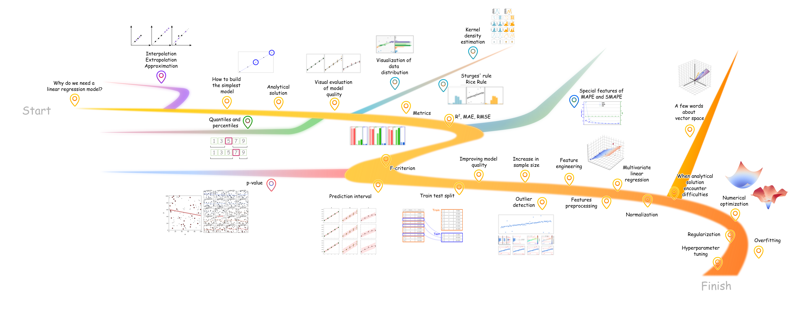

# A Visual Explanation of Linear Regression

[](https://doi.org/10.5281/zenodo.22544297)



This repository contains materials to explain the linear regression algorithm.

## Articles

- habr (rus) - [Как бы я рассказал про линейную регрессию (если б меня кто-то спросил)](https://habr.com/ru/articles/1013998/)
    - GitHub pages: https://dreamlone.github.io/linear-regression/ru/

---

- TDS (eng) - [A Visual Explanation of Linear Regression](https://towardsdatascience.com/a-visual-explanation-of-the-linear-regression/)
    - Github pages: https://dreamlone.github.io/linear-regression/en/

---

- Interactive Handbook (currently WIP) - https://dreamlone.github.io/linear-regression/interactive/

## Why linear regression

I understand that learning new things is difficult.
When studying machine learning and artificial intelligence, it is easy to get lost.

However, there are topics which, when introduced properly, can illuminate entire areas of machine learning,
statistics, and optimization theory.
These topics help integrate numerous concepts that are often understood in isolation.

Linear regression, as one of the simplest machine learning algorithms, is a topic that can tell us about:

- Regression task
- What the model is
- What an analytical solution is
- How to estimate the quality of the model visually
- Metrics to measure the model quality (and their areas of applicability)
- Statistical testing
- Random samples, distribution density
- Level of significance
- Train test sampling
- Preprocessing of categorical features
- Normalization and standardization
- Numerical solution
- Regularization
- Overfitting
- Generation of new features
- How to improve model quality by increasing the sample size
- How to improve model quality through sample reduction (outlier filtering)
- How to improve model quality by increasing the complexity of the model
- How to improve model quality by decreasing the complexity of the model
- and much more

## Why new narrative

This project follows these 4 principles (feel free to use **SORC** as an abbreviation):
- **Show don't tell** Concepts are not only explained in the text, but also visualized.
    There is no need to take anyone's word for it. The most interesting ideas are tested in practice through simulations
    and experiments, followed by discussion of the results.
- **Open for distribution** All materials in this repository are open for use. Please utilize ideas and plots for your work if you like it
- **Reproducibility** Plots, experiments and animations can be reproduced via running the code
- **Consistency** The narrative begins and proceeds sequentially within a single narrative framework. When starting
    this article, I knew how it should be finished, and if the perspective changed during the process, all previously
    written chapters were rewritten.

It is up to the reader of the article and repository to judge whether I managed to stay within the
limits I set for myself, but I sincerely tried.

## How to use this repository

- `examples` - folder with Python code to run experiments, simulations and generates plots & animations
- `kde_explanation` - code which helps to generate visualization for Kernel Density Estimation subbranch of the article
- `plots` - media materials produced by scripts and manually created
- `plots_per_article` - folder with png and gif visualizations grouped by platforms on which articles are published
- `plots_templates` - .svg templates for plots & animations
- `results` - csv and other data artifacts after simulations

Start the exploration with `examples` folder

## How to launch

Clone the repository:

```bash
git clone https://github.com/Dreamlone/linear-regression.git
cd linear-regression
```

Make sure you have Python 3.13 and Poetry installed:

```
python --version
poetry --version
```

Install dependencies from the repository root:

```
poetry install --no-root
```

Run any script from the examples folder, for example:

```
poetry run python examples/1_plot_initial_data.py
```

## How to cite

```
@software{sarafanov_visual_linear_regression_2026,
  author  = {Mikhail Sarafanov},
  title   = {A Visual Explanation of Linear Regression},
  year    = {2026},
  version = {1.1},
  doi     = {10.5281/zenodo.22544297},
  url     = {https://doi.org/10.5281/zenodo.22544297}
}
```

## Work In Progress

The source code is still being improved, but I hope that the implementation of a clean architecture can be done calmly
after the articles are published.
